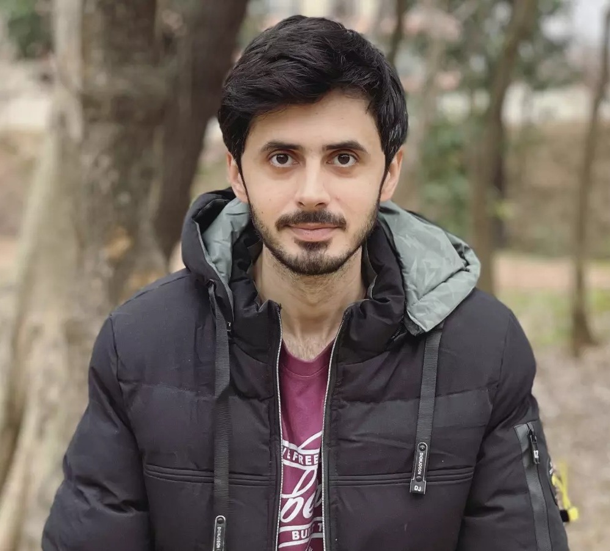

<!-- Profile Image and Title -->

  

# Hello, I'm Faz!
#### Software Developer | Product Development | Artificial Intelligence | Cyber Security

<!-- Contact Details and Connect with Me -->
## 📫 Contact & Connect
- 📧 Email: stunipfm@duck.com
- 💼 LinkedIn: [FazliRaziq](https://www.linkedin.com/in/fazliraziq)

<!-- Skills Section -->
## 💻 Skills
- **Languages:** JavaScript,Typescript, Python, Java
- **Web Development:** HTML, CSS, React, Angular , Nextjs , Nestjs , Typeorm , Express , Serverless , Aws
- **Database:** MongoDB, MySQL , Postgress
- **Tools & Platforms:** Git, GitHub, VS Code , Android Studio , Figma , Canva
- **Other:** Product Development , Problem Solving, Agile Development, Team Collaboration 

<!-- Achievements Section -->
## 🏆 Achievements
- Employee of the Year
- Project Completion Certificates
- Commercially launched a product Nation wide 

<!-- Project Live URLs for Demo -->
## 🚀 Project Demos
1. [Dragon AI](https://dragon-ai-saas.vercel.app/) - A tool for using AI features.
2. [Krypt](http://tinyurl.com/368p2445) - A Tool for sending Ethereium. 
3. [AI Sumz](https://ai-summery.vercel.app/) - A tool for summerizing an article from web.
4. [TicTacToe]([https://ai-summery.vercel.app/](https://tictac-three-ruby.vercel.app/)) - TicTacToe 5x5 with three players.

<!-- Professional Experiences Section -->
## 👔 Professional Experiences
As a highly skilled professional with seven years of experience in the software industry, I have a proven track record of delivering innovative solutions, driving process improvements, and achieving outstanding results. My expertise encompasses Android development, ERP solutions, AI applications, and project management. Throughout my career, I have been recognized for my exceptional performance, including awards for project completions, outstanding success in production, and being named "Employee of the Year." I possess proficiency in a wide range of technologies, including Typescript/JavaScript, Android Studio, Java, Spring Boot, JSP, Hibernate, React, Angular, and AWS Lambda. As a strong leader, I excel in collaborating effectively with cross-functional teams, delivering exceptional outcomes in fast-paced and challenging environments. I am confident that my skills, experience, and achievements make me a valuable asset to any organization seeking a dedicated and results-driven professional.

<!-- GitHub Top Languages -->

<!-- GitHub Stats (Optional) -->

<!-- Visitors Counter (Optional) -->

